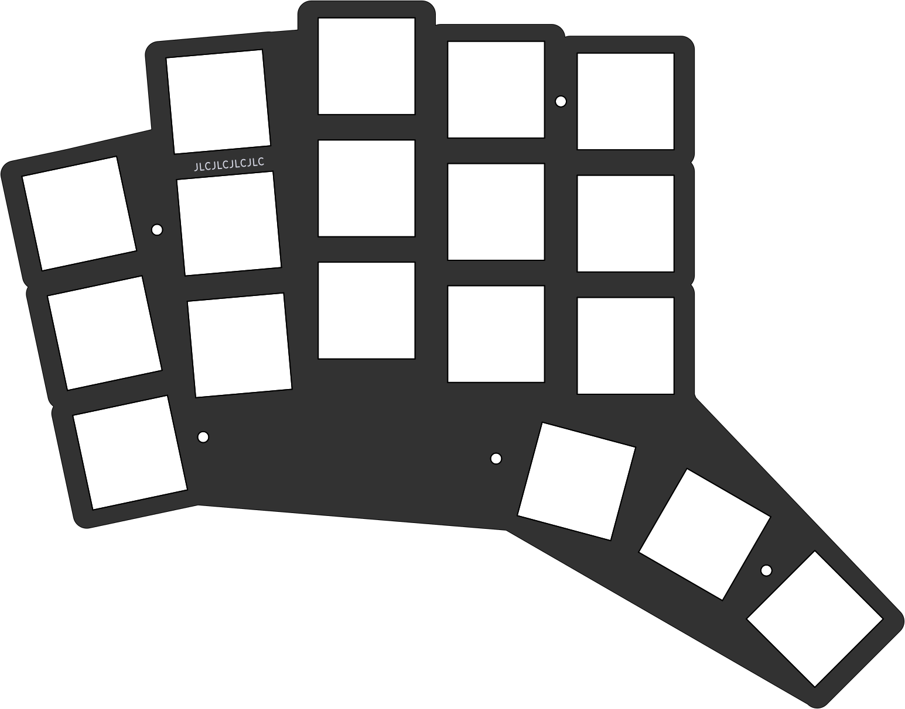
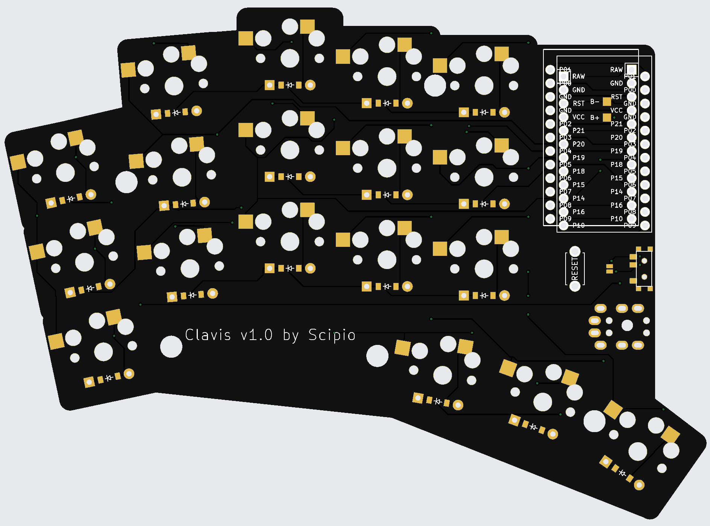
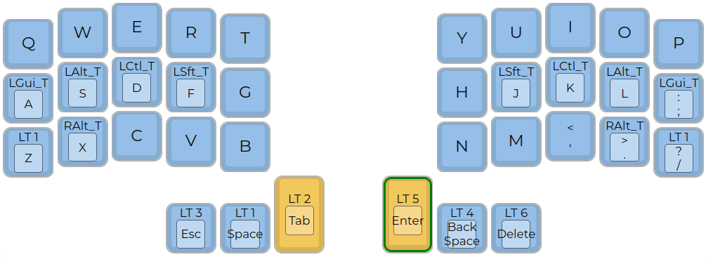

# clavis

## Split 36 key keyboard

- [PCB](pcb/README.md)
- [QMK](qmk/README.md)
- [3D models](3d/)

| left                            | right                           |
| ------------------------------- | ------------------------------- |
|  |  |



  
A 5x3 split keyboard with 3 thumbs. It's inspired by Corne and
has the exact number of keys needed for the [Miryoku](https://github.com/manna-harbour/miryoku) layout.

- Layout is declared using [Ergogen](https://github.com/mrzealot/ergogen/) (https://github.com/soundmonster/ergogen.git fork)
- The build system uses Ergogen to translate YAML to a KiCad PCB and plate files for FR-4 fab or laser cutting
- uses [FreeRouting](https://github.com/freerouting/freerouting) to **automatically route the traces on the PCB**
- uses pcbdraw to render PCB previews
- uses [KiKit](https://github.com/yaqwsx/KiKit) to render production-ready **Gerber files**
- miryoku qmk layout in folder [QMK](qmk/), check [QMK](qmk/README.md)
- blender model with stl in folder [3D](3d/)


Howto:
- run ```make all``` to create python virtualenv and install needed packages
- activate virtualenv: source .venv/bin/activate
- read [PCB](pcb/) to build PCB
- read [QMK](qmk/) to build firmare
- check [QMK](3d/) for 3d models
