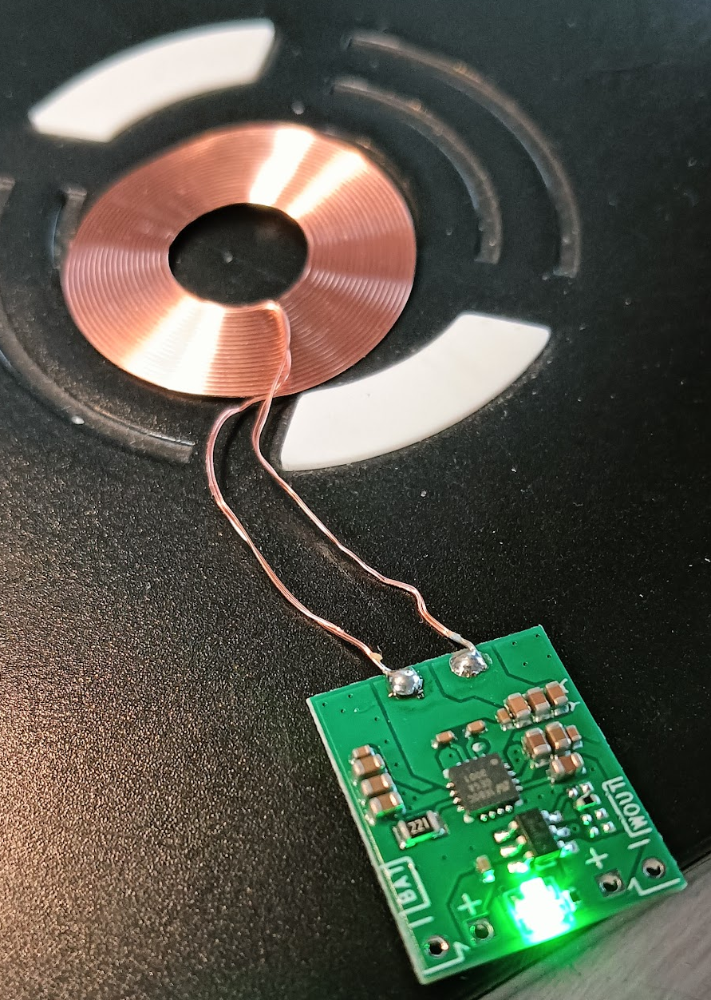
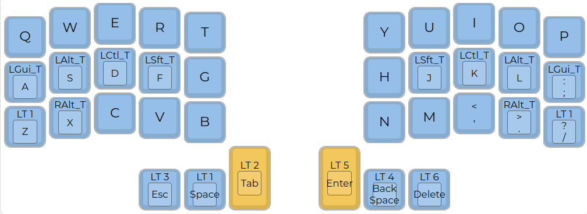

# clavis

## Split 36 key keyboard

- [PCB](pcb/README.md)
- [QMK](firmware/qmk/README.md) firmware with 
- [ZMK](firmware/zmk/README.md) bluetooth firmware with 
- [3D models](3d/)
- TODO ZMK firmware

    
    
     
    
     
    
     
    
     
    

A 5x3 split keyboard with 3 thumbs. It's inspired by Corne and
has the exact number of keys needed for the [miryoku](https://github.com/manna-harbour/miryoku) keyboard layout.

- Wireless bluetooth mode with nice!nano (ZMK firmware) with wireless recharge 
- Wired mode with TRSS and usb (QMK firwmare)
- Layout is declared using [ergogen](https://github.com/mrzealot/ergogen/) (https://github.com/soundmonster/ergogen.git fork)
- The build system uses Ergogen to translate YAML to a KiCad PCB and plate files for FR-4 fab or laser cutting
- uses [freerouting](https://github.com/freerouting/freerouting) to **automatically route the traces on the PCB**
- uses pcbdraw to render PCB previews
- uses [kikit](https://github.com/yaqwsx/KiKit) to render production-ready **Gerber files**
- miryoku qmk layout in folder [QMK](qmk/), check [README](qmk/README.md)
- blender model with stl in folder [3d](3d/)

Howto:

- run `make all` to create python virtualenv and install needed packages
- activate virtualenv: `source .venv/bin/activate`
- read [PCB](pcb/) to build PCB
- read [QMK](qmk/) to build firmare
- check [3d](3d/) for 3d models

## References

- [keyler keyboard](https://github.com/jonathanforking/Keiler) and his [firmware](https://github.com/jonathanforking/Keiler-ZMK)
- [about sockets](https://github.com/joric/nrfmicro/wiki/Sockets)
