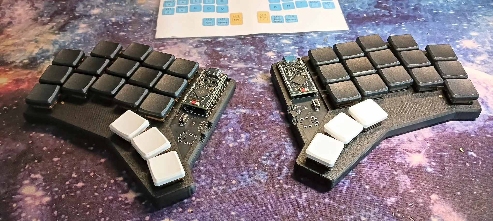
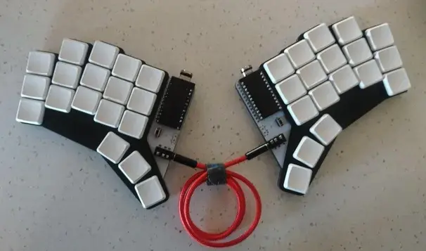
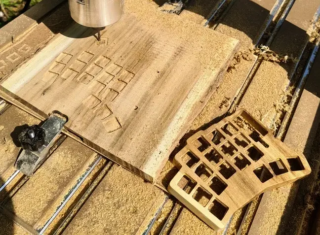
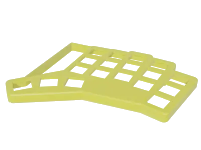

# Clavis: A 36-key Split Keyboard

Clavis is a 5x3 split keyboard with three thumb keys, inspired by the Corne keyboard. It's designed with the perfect number of keys for the [Miryoku](https://github.com/manna-harbour/miryoku) layout.

| Wireless Version (Robinia Wood) | Wireless Version (Bamboo Wood) |
| :---: | :---: |
|  |  |

| Wireless Version | TRRS Version |
| :---: | :---: |
|  |  |

| Wireless Charging | CNC Case |
| :---: | :---: |
|  |  |

| PCB | STL Model | Miryoku Layout |
| :---: | :---: | :---: |
|  |  |  |

## Features

*   **Wireless Mode:** Bluetooth connectivity using the nice!nano (ZMK firmware) with wireless charging support.
*   **Wired Mode:** Traditional wired connection via TRRS and USB (QMK firmware).
*   **Declarative Layout:** The keyboard layout is defined using [Ergogen](https://github.com/mrzealot/ergogen/) (using the [soundmonster fork](https://github.com/soundmonster/ergogen.git)).
*   **Automated Workflow:** The build system leverages Ergogen to generate KiCad PCB and plate files from YAML descriptions, suitable for FR-4 fabrication or laser cutting.
*   **Auto-Routing:** Utilizes [freerouting](https://github.com/freerouting/freerouting) to automatically route the PCB traces.
*   **PCB Previews:** Generates PCB previews using [pcbdraw](https://github.com/yaqwsx/pcbdraw).
*   **Production-Ready Gerbers:** Creates production-ready Gerber files with [KiKit](https://github.com/yaqwsx/KiKit).

## Project Components

*   [**PCB**](pcb/README.md): Ergogen-based PCB design and manufacturing files.
*   [**QMK Firmware**](firmware/qmk/README.md): Firmware for wired operation, featuring the [Miryoku layout](firmware/qmk/clavis/README.md).
*   [**ZMK Firmware**](firmware/zmk/README.md): Bluetooth firmware with the [Miryoku layout](firmware/README.md).
*   [**3D Models**](3d/): Blender and STL files for the case.

## Getting Started

1.  **Installation:** Run `make all` to create a Python virtual environment and install the necessary packages.
2.  **Activate Virtual Environment:** `source .venv/bin/activate`
3.  **Build the PCB:** Follow the instructions in the [PCB directory](pcb/).
4.  **Build the Firmware:** Follow the instructions in the [QMK](firmware/qmk/) or [ZMK](firmware/zmk/) directories.
5.  **3D Print the Case:** Check the [3D directory](3d/) for the 3D models.

## References

*   [Keiler Keyboard](https://github.com/jonathanforking/Keiler) and its [firmware](https://github.com/jonathanforking/Keiler-ZMK)
*   [About Sockets](https://github.com/joric/nrfmicro/wiki/Sockets)
