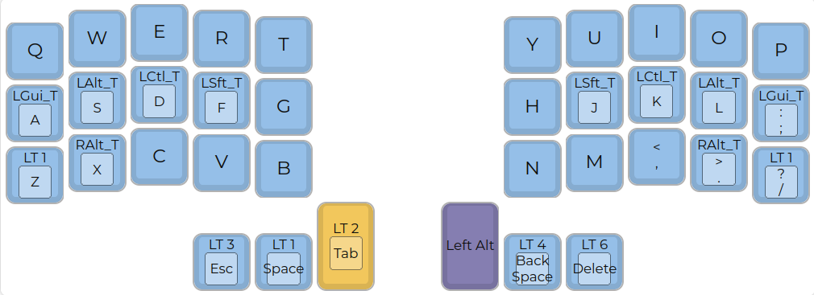
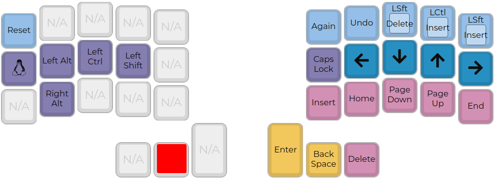
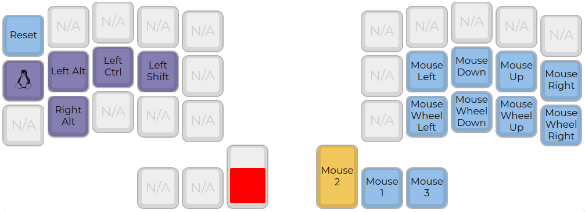
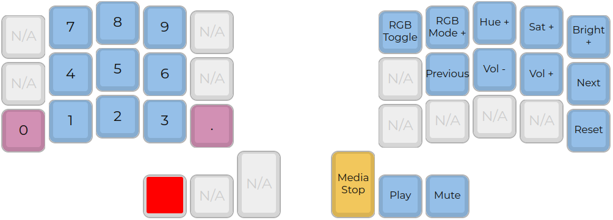
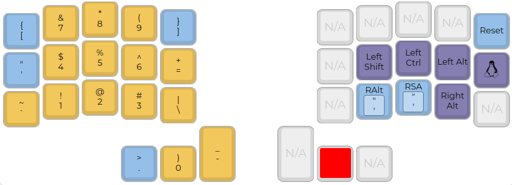
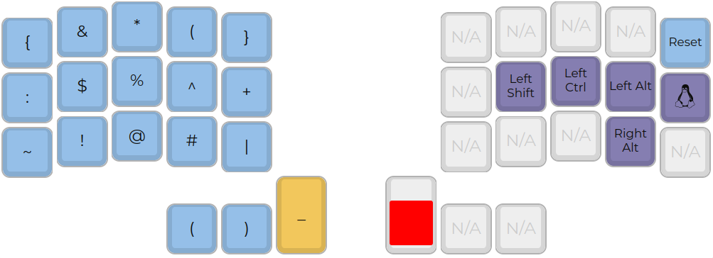
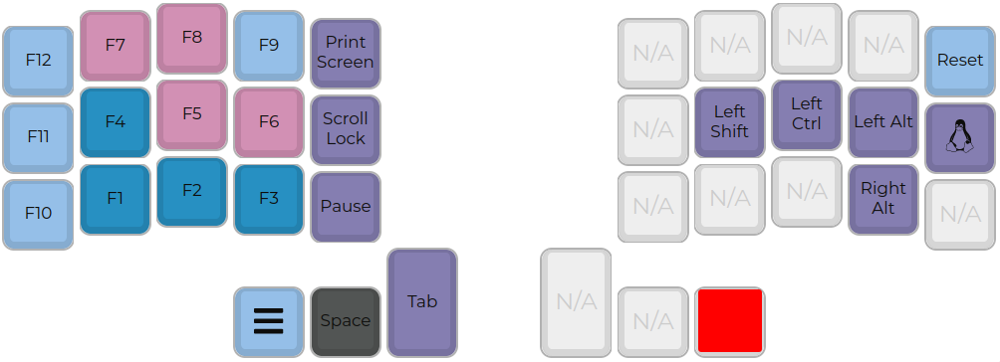

# Clavis QMK Layout

This directory contains the QMK keymap for the Clavis keyboard, a 36-key Corne-inspired split keyboard.

*   **Minimal Hardware:** Designed for builds without LEDs or OLED displays.
*   **36-Key Miryoku Layout:** The keymap is based on the [Miryoku layout](https://github.com/manna-harbour/miryoku).
*   **PCB Project:** The hardware project can be found at [scipioni/clavis](https://github.com/scipioni/clavis).

---

## Flashing Instructions

*   **Pro Micro:** `sudo make crkbd:clavis:avrdude`
*   **Elite-C:** `sudo make crkbd:clavis:dfu`

---

## Keymap Layers

| Layer 0 (Base) | Layer 1 (Symbols) |
| :---: | :---: |
|  |  |

| Layer 2 (Navigation) | Layer 3 (Mouse) |
| :---: | :---: |
|  |  |

| Layer 4 (Function Keys) | Layer 5 (Numpad) |
| :---: | :---: |
|  |  |

| Layer 6 (Settings) |
| :---: |
|  |
