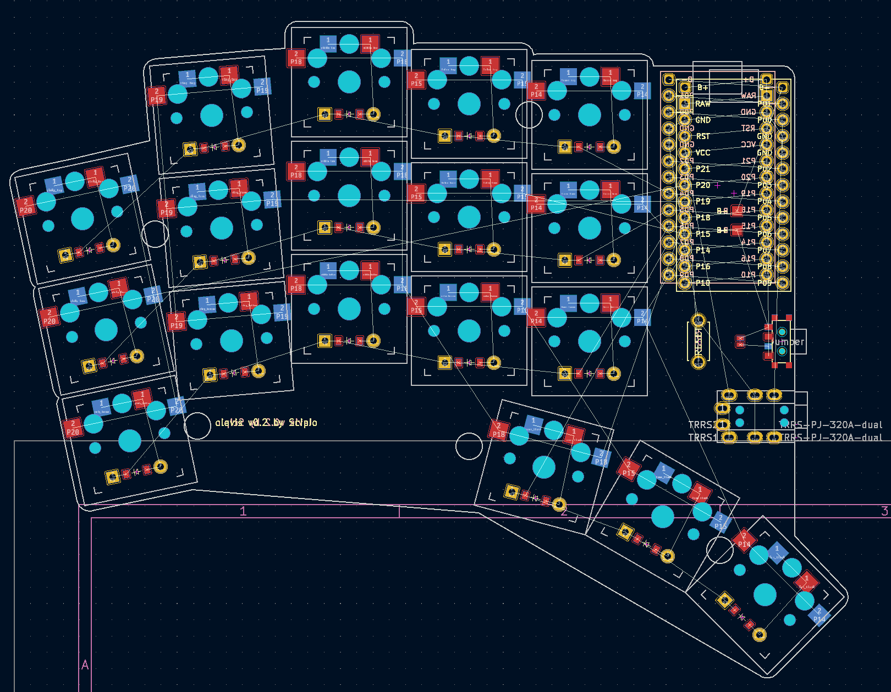

# Clavis PCB

## References

- https://flatfootfox.com/ergogen-part4-footprints-cases/
- https://github.com/sloba-byte/ergogen_howtos  

## Features

- Extra pins and a slider switch for battery for wireless Promicro clones (nice!nano, etc); the slider can be shorted with a jumper if `CONFIG_ZMK_SLEEP` is preferred.
- Wired operation with QMK: TRRS footprints are included and routed. The pinout is identical with a five-column Corne sans the RGBLEDs.
- Reset switches are easily accessible. The footprints used are the same as on the Corne.

## Bill of materials

### both versions


- [Kailh hot swapping pcb sockets for choc kailh low profile](https://www.aliexpress.com/item/32901654130.html?spm=a2g0o.order_list.order_list_main.41.57841802uASasS) x 36
- [kailh low profile choc switch](https://www.aliexpress.com/item/32838369089.html?spm=a2g0o.order_list.order_list_main.58.57841802uASasS) x 36
- [MBK Choc Low Profile Keycaps 1U](https://keycapsss.com/keyboard-parts/keycaps/169/mbk-choc-low-profile-blank-keycaps?c=16) x 34
- [MBK Choc Low Profile Keycaps 1U homing](https://keycapsss.com/keyboard-parts/keycaps/169/mbk-choc-low-profile-blank-keycaps?number=KC10130_1U-H-WH&c=16) x 2
- [diode 1N4148 SOD-123]() x 36
- [micro switch push button ](https://www.aliexpress.com/item/1068908059.html?spm=a2g0o.order_list.order_list_main.209.57841802uASasSs) x 2

### TRSS version

- [TRRS audio cable](https://www.aliexpress.com/item/1005003613205582.html?spm=a2g0o.order_list.order_list_main.11.57841802uASasS)
- [TRRS jack](https://www.aliexpress.com/item/33029465106.html?spm=a2g0o.order_list.order_list_main.35.57841802uASasS) x 2
- [pin connector for micro](https://www.aliexpress.com/item/4000379224241.html?spm=a2g0o.order_list.order_list_main.17.57841802uASasS) 
- [Pro Micro ATMEGA32U4](https://www.aliexpress.com/item/32888212119.html?spm=a2g0o.order_list.order_list_main.23.57841802uASasS) 

### bluetooth

- [other pin connector for micro](https://www.aliexpress.com/item/1005005742644313.html?spm=a2g0o.order_list.order_list_main.11.4fb95e5bcPfOfl)
- [NRF52840 Supermini (compatible with Nice!Nano V2.0)](https://www.aliexpress.com/item/1005006343285322.html)

## How to

- prereq:
  - nodejs
  - kicad 8
  - java >= 11 (for method B: freerouting)

## Layout

Edit config.yaml and check on

- https://ergogen.cache.works/


## Introspection

Input file of entire process is config.yaml in ergogen format.

### step 1: ergogen - from yaml -> to kicad pcb

```
# make clean
make kicad
```

output: kicad pcb

```
output/pcbs/
├── board.kicad_pcb
├── bottom_plate.kicad_pcb
└── top_plate.kicad_pcb
output/outlines/*
```

open kicad pcb

```
pcbnew output/pcbs/board.kicad_pcb
```



## EasyEda routing (method A)

### step 2: import kicad in easyeda

import kicad project: File -> Open -> Kicad -> output/kicad.zip 

## Freerouting routing (method B)

### step 2: kicad - from kicad pcb -> to specctra DSN

with kicad gui:

- Export the PCB into Specctra DSN (File / Export... / Specctra DSN).

or with cli:

```
make output/pcbs/board.dsn
```

### step 3: autoroute with freerouting - from DSN -> to ses file

set autorouter algorithm to slow (as in 2.0.1 via GUI only)

```
export PATH="/usr/lib/jvm/java-23-openjdk/bin/:$PATH"
make output/routed_pcbs/board.ses
```

click with left mouse if loop

### step 4: kicad - merge routed session

with kicad gui:

- open unrouted pcb: pcbnew output/pcbs/board.kicad_pcb
- import output/routed_pcbs/board.ses file: Import -> Specctra session
- check DRC: Inspect -> Design Rule Checker
- ...
- save output/routed_pcbs/board.kicad_pcb

or with cli: TODO

## step 5: kikit - create gerbers

create gerbers in output/gerbers

```
make gerbers-board
```

go to https://jlcpcb.com/ and upload output/gerbers/board/gerbers.zip

## Convert output dxf to svg

```
https://convertio.co/
```

## freerouting build

install jdk21-openjdk

```
export PATH="/usr/lib/jvm/java-21-openjdk/bin/:$PATH"

git clone --depth 1 https://github.com/freerouting/freerouting.git
cd freerouting
./gradlew assemble
cp build/libs/freerouting-executable.jar ../bin/freerouting-executable.jar
```

## TODO

- import Specctra session with scripts/import_ses.py
- fix pcbdraw of images/board-front.png
-
