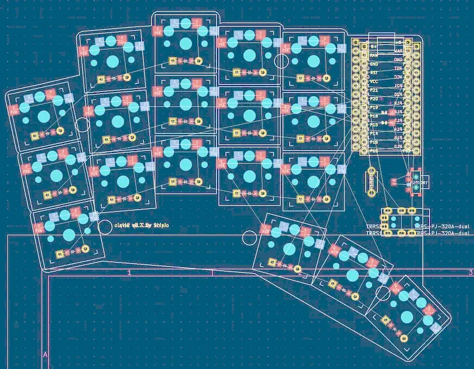

# Clavis PCB

This document outlines the features, bill of materials, and build process for the Clavis PCB.

## Features

*   **Wireless Ready:** Includes extra pins and a slider switch for a battery, designed for wireless ProMicro clones like the nice!nano. The slider can be shorted with a jumper if using `CONFIG_ZMK_SLEEP` is preferred.
*   **Wired Compatibility:** Supports wired operation with QMK. TRRS footprints are included and routed, with a pinout identical to a five-column Corne (excluding RGB LEDs).
*   **Accessible Reset Switches:** The reset switches are easy to access, using the same footprint as the Corne keyboard.

## Bill of Materials

### Common Components (for both versions)

*   36x [Kailh Choc Low-Profile Hot-Swap Sockets](https://www.aliexpress.com/item/32901654130.html)
*   36x [Kailh Choc Low-Profile Switches](https://www.aliexpress.com/item/32838369089.html)
*   34x [MBK Choc Low-Profile 1U Keycaps](https://keycapsss.com/keyboard-parts/keycaps/169/mbk-choc-low-profile-blank-keycaps?c=16)
*   2x [MBK Choc Low-Profile 1U Homing Keycaps](https://keycapsss.com/keyboard-parts/keycaps/169/mbk-choc-low-profile-blank-keycaps?number=KC10130_1U-H-WH&c=16)
*   36x [1N4148 SOD-123 Diodes](https://www.aliexpress.com/item/1005005742644313.html)
*   2x [Micro Switch Push Buttons](https://www.aliexpress.com/item/1068908059.html)

### TRRS Version Components

*   1x [TRRS Audio Cable](https://www.aliexpress.com/item/1005003613205582.html)
*   2x [TRRS Jacks](https://www.aliexpress.com/item/33029465106.html)
*   [Pin Connectors for Microcontroller](https://www.aliexpress.com/item/4000379224241.html)
*   [Pro Micro ATMEGA32U4](https://www.aliexpress.com/item/32888212119.html)

### Bluetooth Version Components

*   [Pin Connectors for Microcontroller](https://www.aliexpress.com/item/1005005742644313.html)
*   [NRF52840 Supermini (nice!nano V2.0 compatible)](https://www.aliexpress.com/item/1005006343285322.html)

## Build Process

### Prerequisites

*   Node.js
*   KiCad 8
*   Java >= 11 (for freerouting)

### 1. Layout Configuration

Edit `config.yaml` to define your desired layout. You can use the [online Ergogen tool](https://ergogen.cache.works/) to visualize your changes.

### 2. Generate KiCad PCB

This step uses Ergogen to convert your `config.yaml` into KiCad PCB files.

```bash
# Clean previous builds
make clean
# Generate KiCad files
make kicad
```

This will generate the following files in the `output/pcbs/` directory:
* `board.kicad_pcb`
* `bottom_plate.kicad_pcb`
* `top_plate.kicad_pcb`

You can open the PCB in KiCad to inspect it:
```bash
pcbnew output/pcbs/board.kicad_pcb
```



### 3. Routing

You can choose one of the following methods to route the PCB traces.

#### Method A: EasyEDA Routing

1.  **Export to EasyEDA:** Zip the `output` directory.
2.  **Import to EasyEDA:** In EasyEDA, go to `File -> Open -> KiCad` and upload the zip file.

#### Method B: Freerouting

1.  **Export to Specctra DSN:**
    *   **GUI:** In KiCad, open the board and go to `File -> Export... -> Specctra DSN`.
    *   **CLI:**
        ```bash
        make output/pcbs/board.dsn
        ```

2.  **Autoroute with Freerouting:**
    *   Set the autorouter algorithm to "slow" (in Freerouting 2.0.1, this can only be done via the GUI).
    *   Run the autorouter:
        ```bash
        export PATH="/usr/lib/jvm/java-23-openjdk/bin/:$PATH"
        make output/routed_pcbs/board.ses
        ```
    *   If the process seems to be stuck in a loop, click with the left mouse button.

3.  **Import Routed Session into KiCad:**
    *   **GUI:**
        1.  Open the unrouted PCB: `pcbnew output/pcbs/board.kicad_pcb`
        2.  Import the routed session: `Import -> Specctra session` and select `output/routed_pcbs/board.ses`.
        3.  Run the Design Rule Checker: `Inspect -> Design Rule Checker`.
        4.  Save the routed PCB to `output/routed_pcbs/board.kicad_pcb`.
    *   **CLI:** (TODO)

### 4. Generate Gerbers

This step uses KiKit to create the Gerber files for manufacturing.

```bash
make gerbers-board
```

This will create a `gerbers.zip` file in `output/gerbers/board/`. You can upload this file to a PCB manufacturer like [JLCPCB](https://jlcpcb.com/).

### 5. Create a Release

```bash
git tag -a v1.2 -m "version 1.2"
zip -qr /tmp/clavis-1.2.zip output
```

## Miscellaneous

### DXF to SVG Conversion

You can use an online tool like [Convertio](https://convertio.co/) to convert DXF files to SVG.

### Building Freerouting from Source

1.  Install OpenJDK 21.
2.  Clone the repository and build the executable:
    ```bash
    export PATH="/usr/lib/jvm/java-21-openjdk/bin/:$PATH"
    git clone --depth 1 https://github.com/freerouting/freerouting.git
    cd freerouting
    ./gradlew assemble
    cp build/libs/freerouting-executable.jar ../bin/freerouting-executable.jar
    ```

## TODO

*   Implement a script to import the Specctra session (`scripts/import_ses.py`).
*   Fix the `pcbdraw` rendering of `images/board-front.png`.

## References

*   [Ergogen Part 4: Footprints & Cases](https://flatfootfox.com/ergogen-part4-footprints-cases/)
*   [Ergogen HOWTOs](https://github.com/sloba-byte/ergogen_howtos)