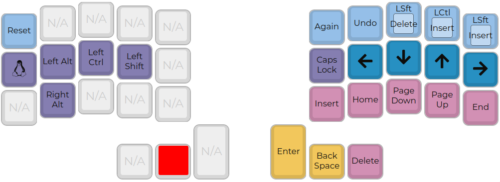
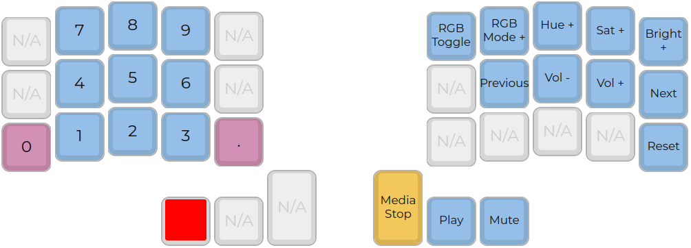
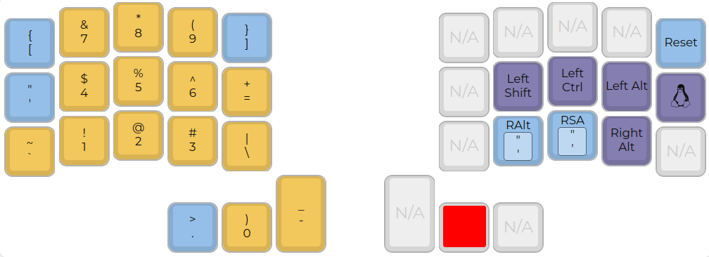
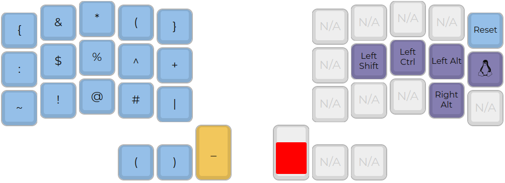
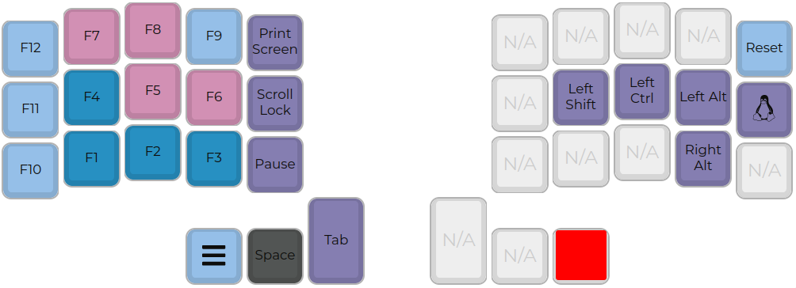

# **Clavis**

## Corne Keyboard (CRKBD) **Clavis** layout by [scipioni](https://github.com/scipioni)

- **Minimal hardware**: no led and no oled display.
- **36 keys** with [Miryoku](https://github.com/manna-harbour/miryoku) layout.
- **PCB** project [clavis](https://github.com/scipioni/clavis).

---

## *Flashing**

For *Pro Micro* execute: `sudo make crkbd:clavis:avrdude`

For *Elite-C* execute: `sudo make crkbd:clavis:dfu`

---

## **Layers**

### 0

### 1

### 2

### 3

### 4

### 5

### 6
